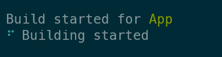
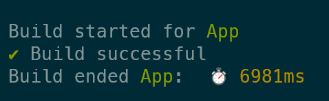
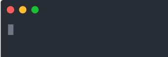

# esbuild-plugin-time-spinner   []()
Log esbuild progress spinner and build time

<div align="center">

  []()
  [](https://github.com/younes-barhouni/esbuild-plugin-time-spinner/issues)
  [](https://github.com/younes-barhouni/esbuild-plugin-time-spinner/pulls)

</div>

## Install
```js
// if using npm
npm i -D esbuild-plugin-time-spinner
// if using yarn
yarn add -D esbuild-plugin-time-spinner
// if using pnpm
pnpm i -D esbuild-plugin-time-spinner
```

## Usage example
```ts
import esbuild from "esbuild";
import logTimeSpinner from "esbuild-plugin-time-spinner"
esbuild.build({
  entryPoints: ['./index.tsx'],
  bundle: false,
  outdir: 'out',
  plugins: [
    logTimeSpinner()
  ]
})
```




## Options
When instantiating plugin you can pass an objects with options. 

```ts
interface IOptions {
  name?: string;
  message?: string;
  spinner?: SpinnerName | Spinner;
}
```

### Spinner types preview


```ts
type SpinnerName =
		| 'dots'
		| 'dots2'
		| 'dots3'
		| 'dots4'
		| 'dots5'
		| 'dots6'
		| 'dots7'
		| 'dots8'
		| 'dots9'
		| 'dots10'
		| 'dots11'
		| 'dots12'
		| 'dots8Bit'
		| 'sand'
		| 'line'
		| 'line2'
		| 'pipe'
		| 'simpleDots'
		| 'simpleDotsScrolling'
		| 'star'
		| 'star2'
		| 'flip'
		| 'hamburger'
		| 'growVertical'
		| 'growHorizontal'
		| 'balloon'
		| 'balloon2'
		| 'noise'
		| 'bounce'
		| 'boxBounce'
		| 'boxBounce2'
		| 'binary'
		| 'triangle'
		| 'arc'
		| 'circle'
		| 'squareCorners'
		| 'circleQuarters'
		| 'circleHalves'
		| 'squish'
		| 'toggle'
		| 'toggle2'
		| 'toggle3'
		| 'toggle4'
		| 'toggle5'
		| 'toggle6'
		| 'toggle7'
		| 'toggle8'
		| 'toggle9'
		| 'toggle10'
		| 'toggle11'
		| 'toggle12'
		| 'toggle13'
		| 'arrow'
		| 'arrow2'
		| 'arrow3'
		| 'bouncingBar'
		| 'bouncingBall'
		| 'smiley'
		| 'monkey'
		| 'hearts'
		| 'clock'
		| 'earth'
		| 'material'
		| 'moon'
		| 'runner'
		| 'pong'
		| 'shark'
		| 'dqpb'
		| 'weather'
		| 'christmas'
		| 'grenade'
		| 'point'
		| 'layer'
		| 'betaWave'
		| 'fingerDance'
		| 'fistBump'
		| 'soccerHeader'
		| 'mindblown'
		| 'speaker'
		| 'orangePulse'
		| 'bluePulse'
		| 'orangeBluePulse'
		| 'timeTravel'
		| 'aesthetic'
		| 'dwarfFortress';
```