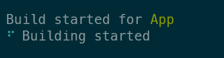
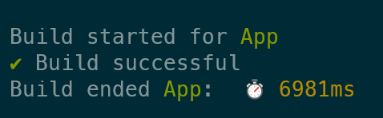

# esbuild-plugin-time-spinner   []()
Log esbuild progress spinner and build time

<div align="center">

  []()
  [](https://github.com/younes-barhouni/esbuild-plugin-time-spinner/issues)
  [](https://github.com/younes-barhouni/esbuild-plugin-time-spinner/pulls)

</div>

## Install
```js
// if using npm
npm i -D esbuild-plugin-time-spinner
// if using yarn
yarn add -D esbuild-plugin-time-spinner
// if using pnpm
pnpm i -D esbuild-plugin-time-spinner
```

## Usage example
```ts
import esbuild from "esbuild";
import logTimeSpinner from "esbuild-plugin-time-spinner"
esbuild.build({
  entryPoints: ['./index.tsx'],
  bundle: false,
  outdir: 'out',
  plugins: [
    logTimeSpinner()
  ]
})
```




## Options
When instantiating plugin you can pass an objects with options. This object has SWC official `Compilation` type, see detail in [Compilation](https://swc.rs/docs/configuration/compilation)。